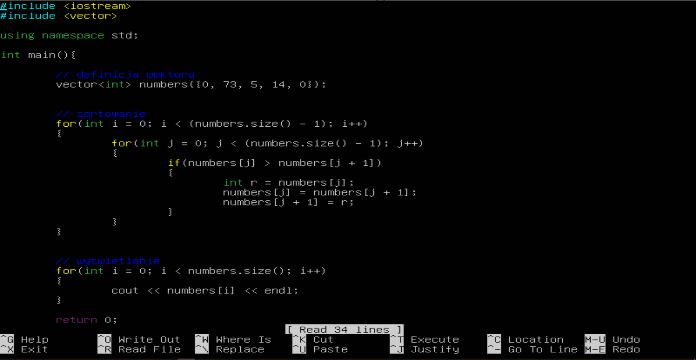

# Student projects

## About
These are various projects done on my school exercises. They contain some C++ code, as well as Python and HTML.

## Credits
To Mr. Filipak, some nice teacher.  
[His Github](https://github.com/marcin-filipiak)

## Screenshots


## Codes
Empty C++ code:  

```cpp
#include<iostream>
using namespace std;

int main()
{
  return 0;
}
```

## Authors
[Julian9B](https://github.com/Julian9B)
