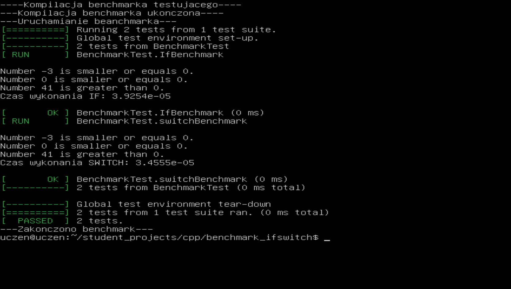

# Benchmark If & Switch

## About
This is simple excercise with testing. 
 
We use this code to check which method of choice is faster - If or Switch.

## Code

Firstly, we have two functions in file 'main_test.cpp': one for If and the other one for Switch.

```cpp
// Funkcja sprawdzająca if
void if_check(int number) {

    if(number > 0) {
	cout << "Number " << number << " is greater than 0." << endl;
    } else {
	cout << "Number " << number << " is smaller or equals 0." << endl;
    }
}

// Funkcja sprawdzająca switch
void switch_check(int number){

    switch(number > 0) {
	case true:
	    cout << "Number " << number << " is greater than 0." << endl;
	    break;
	default:
	    cout << "Number " << number << " is smaller or equals 0." << endl;
	    break;
    }
}
```

To test it, we use 3 variables for each:

```cpp
int number1 = -3;
int number2 = 0;
int number3 = 41;
```

We use gtests to measure execution time of both functions.

```cpp
// Test wydajności if
TEST(BenchmarkTest, IfBenchmark) {

    // Początek pomiaru czasu
    auto start = std::chrono::high_resolution_clock::now();

    cout << endl;
    if_check(number1);
    if_check(number2);
    if_check(number3);

    // Koniec pomiaru czasu
    auto end = std::chrono::high_resolution_clock::now();
    std::chrono::duration<double> elapsed_seconds = end - start;

    std::cout << "Czas wykonania IF: " << elapsed_seconds.count() << endl << endl;
}

// Test wydajności switch
TEST(BenchmarkTest, switchBenchmark) {

    // Początek pomiaru czasu
    auto start = std::chrono::high_resolution_clock::now();

    cout << endl;
    switch_check(number1);
    switch_check(number2);
    switch_check(number3);

    // Koniec pomiaru czasu
    auto end = std::chrono::high_resolution_clock::now();
    std::chrono::duration<double> elapsed_seconds = end - start;

    std::cout << "Czas wykonania SWITCH: " << elapsed_seconds.count() << endl << endl;
}
```

And finally, we call the tests from 'main' function.

```cpp
int main(int argc, char **argv) {

    ::testing::InitGoogleTest(&argc, argv);
    return RUN_ALL_TESTS();
}
```

## Result


## Conclusion
From the test we can see that Switch instruction is faster than If.

## Authors
[Julian9B](https://github.com/Julian9B)
