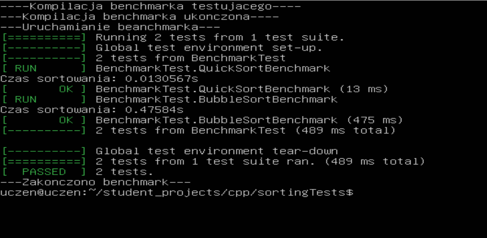

# Sorting tests

## About
This is simple excercise with sorting and testing. 
 
The code creates vector consisting 10000 random numbers and sorts it in 2 ways - Quicksort and Bubblesort, using unit testing. It also measures time and says which method is faster.

## History

I started from test template, including only Quicksort:
```cpp
#include <iostream>
#include <vector>
#include <algorithm>
#include <ctime>
#include "gtest/gtest.h"
#include <chrono>

// Funkcja sortująca wektor za pomocą QuickSort
void quickSort(std::vector<int>& vec)
{
    if (vec.size() <= 1) return;
    int pivot = vec[vec.size() / 2];
    std::vector<int> left, right;
    for (size_t i = 0; i < vec.size(); i++) {
        if (vec[i] < pivot) left.push_back(vec[i]);
        else if (vec[i] > pivot) right.push_back(vec[i]);
    }
    quickSort(left);
    quickSort(right);
    vec.clear();
    vec.insert(vec.end(), left.begin(), left.end());
    vec.push_back(pivot);
    vec.insert(vec.end(), right.begin(), right.end());
}

// Test wydajności sortowania QuickSort
TEST(BenchmarkTest, QuickSortBenchmark) {

    std::vector<int> originalVec(10000); // Tworzymy wektor z 10000 losowymi liczbami
    std::srand(std::time(0)); // Inicjalizacja generatora liczb losowych
    std::generate(originalVec.begin(), originalVec.end(), std::rand);
    
    // Początek pomiaru czasu
    auto start = std::chrono::high_resolution_clock::now();

    quickSort(originalVec); // Sortujemy wektor

    // Koniec pomiaru czasu
    auto end = std::chrono::high_resolution_clock::now();
    std::chrono::duration<double> elapsed_seconds = end - start;

    std::cout << "Czas sortowania: " << elapsed_seconds.count() << "s\n";
}

int main(int argc, char **argv) {
    ::testing::InitGoogleTest(&argc, argv);
    return RUN_ALL_TESTS();
}
```

You can see current code in 'main_test.cpp' file.

## Result


## Conclusion
The test shows clearly that Quicksort is a lot faster than Bubblesort.

## Authors
[Julian9B](https://github.com/Julian9B)
