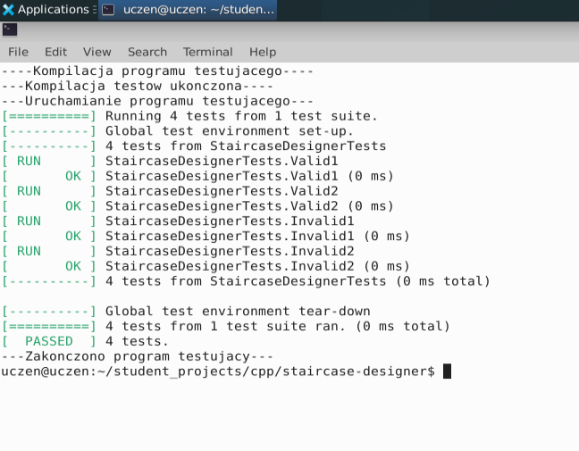
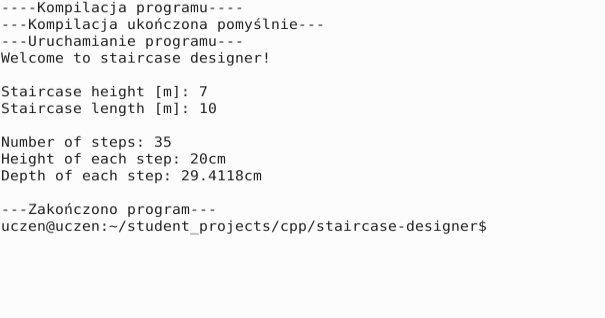

# Staircase designer

## 1. About

This exercise is about creating app that can design a stairs based on user input data. We start from a console app and modify it to be a window app later.

### 1.1. Use case

| USE CASE       | Staircase designer app |
| -------------- | ---------------------- |
| ACTOR          | A person using system |
| GOAL           | User wants to get data about stairs steps' height and depth, based on height and length of entire staircase |
| BASIC FLOW     | 1. User opens the app. <br> 2. User enters height and length of the staircase [m] into 'Staircase height' and 'Staircase length' fields. <br> 3. App defines that it is possible to create a staircase with user's data. <br> 4. App calculates number, height and depth of the steps [cm] and returns them to the user. |
| EXCEPTION FLOW | 1. User opens the app. <br> 2. User enters height and length of the staircase [m] into 'Staircase height' and 'Staircase length' fields. <br> 3. App defines that it is impossible to create a staircase with user's data. <br> 4. App returns an error message to the user. |

Tab.1.

### 1.2. The problem

If given height and length are very unreal (i.e. 10m/1m), the program should return invalid data message. To do that, we need to check if their height to length ratio fits in ergonomic dimensions of staircase. 
 
To calculate height and depth of the steps, we first need to calculate their number. We do that by dividing staircase's height by height of ergonomic step's height and round the result. Then, the we divide the height of the staircase by number of steps to get exact height of single step. Finally, we divide the length of staircase by number of steps minus one (because the last step is already the next floor so we don't need to count it) to get the depth of single step.

### 1.3. Plan for code

We need function, that validates user data, and calculates dimensions if valid. It returns bool defining if it is possible to create such staircase. Other variables are sent to function as references and filled inside it. We're going to have that function in 'functions.cpp' file. In the 'main.cpp' file we're going to get user's input, call the function and return message, based on function's result.

We are also going to have a file with benchmark tests to check if the function works properly.

## 2. Code

#### Functions file

In the file 'functions.cpp' we have the function that validates input data and calculates output data.

```cpp
bool calculateStaircase(double heightOverall, double lengthOverall, int& stepsNumber, double& stepHeight, double& stepDepth){

	double ratio = heightOverall / lengthOverall;
	double minRatio = 0.5;
	double maxRatio = 0.9;

	// define whether or not it's possible to create an ergonomic staircase
	bool possible = ratio <= maxRatio && ratio >= minRatio;

	if(possible){
		
		double perfectStepHeight = 20;
		double unroundedStepsNumber = (heightOverall * 100) / perfectStepHeight;

		stepsNumber = round(unroundedStepsNumber);
		stepHeight = (heightOverall * 100) / stepsNumber;
		stepDepth = (lengthOverall * 100) / (stepsNumber - 1);
	}

	return possible;
}
```

### Test

We test the calculating function using gtests in the file called 'main_test.cpp'.

```cpp
TEST(StaircaseDesignerTests, Valid1) { // input is valid

	double heightOverall = 7;
	double lengthOverall = 10;

	int stepsNumber;
	double stepHeight;
	double stepDepth;

	EXPECT_EQ(calculateStaircase(heightOverall, lengthOverall, stepsNumber, stepHeight, stepDepth), true); // returns true
	EXPECT_EQ(stepsNumber, 35);
	EXPECT_EQ(round(stepHeight), 20);
	EXPECT_EQ(round(stepDepth), 29); // calculates output
}

TEST(StaircaseDesignerTests, Valid2) { // input is valid

	double heightOverall = 3.5;
	double lengthOverall = 5;

	int stepsNumber;
	double stepHeight;
	double stepDepth;

	EXPECT_EQ(calculateStaircase(heightOverall, lengthOverall, stepsNumber, stepHeight, stepDepth), true); // returns true
	EXPECT_EQ(stepsNumber, 18);
	EXPECT_EQ(round(stepHeight), 19);
	EXPECT_EQ(round(stepDepth), 29); // calculates output
}

TEST(StaircaseDesignerTests, Invalid1) { // input is invalid

	double heightOverall = 5;
	double lengthOverall = 3;

	int stepsNumber;
	double stepHeight;
	double stepDepth;

	EXPECT_EQ(calculateStaircase(heightOverall, lengthOverall, stepsNumber, stepHeight, stepDepth), false); // returns false and doesn't calculates output
}

TEST(StaircaseDesignerTests, Invalid2) { // input is invalid

	double heightOverall = 10;
	double lengthOverall = 30;

	int stepsNumber;
	double stepHeight;
	double stepDepth;

	EXPECT_EQ(calculateStaircase(heightOverall, lengthOverall, stepsNumber, stepHeight, stepDepth), false); // returns false and doesn't calculates output
}


int main(int argc, char **argv) {
    ::testing::InitGoogleTest(&argc, argv);
    return RUN_ALL_TESTS();
}
```

#### Main program
 
In the file 'main.cpp' we have 'main' function that gets overall height and length of the staircase from user, then calls calculating function and returns pertinent message.

```cpp
int main(){

	cout << "Welcome to staircase designer!" << endl << endl;

	double heightOverall;
	cout << "Staircase height [m]: ";
	cin >> heightOverall;

	double lengthOverall;
	cout << "Staircase length [m]: ";
	cin >> lengthOverall;
	cout << endl;

	int stepsNumber;
	double stepHeight;
	double stepDepth;

	if(calculateStaircase(heightOverall, lengthOverall, stepsNumber, stepHeight, stepDepth)){

		cout << "Number of steps: " << stepsNumber << endl << "Height of each step: " << stepHeight << "cm" << endl << "Depth of each step: " << stepDepth << "cm" << endl << endl; // if input is valid
	}else{

		cout << "Sorry, it is impossible to create ergonomic staircase using dimensions given by you." << endl << endl; // if input is invalid
	}

	return 0;
}
```

Other files are useful to compile the program.

## 3. Result

On Img.1. we can see the result of function testing (compilation of 'main_test.cpp' file). All tests end by success.
 
<br>
Img. 1.
 
On Img.2. we see the result of compiling 'main.cpp' file and inserting valid data for staircase's dimensions. Program calculates output properly.

<br>
Img. 2.

On Img.3. we see that program throws 'Invalid data' message when we give it invalid data.

<br>
Img. 3.

## 4. Conclusion

In this project, we created a working console app in C++. We can see that benchmarks are useful to check if function is working as desired. Next, we want to make a window app based on that project.
 
You can see the project as a window app by clicking [here](https://github.com/Julian9B/student_projects/tree/main/maui/staircase-designer).

## Authors
[Julian9B](https://github.com/Julian9B)
