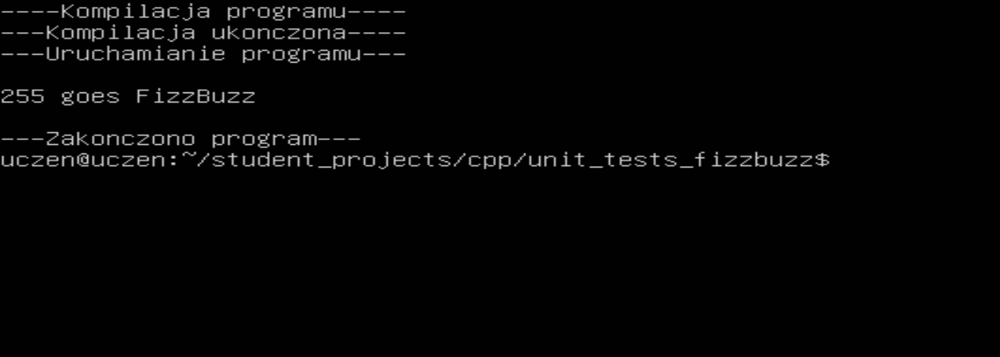

# FizzBuzz

## 1. About

FizzBuzz is C++ exercise of assertion using gtests. In this exercise we create a function, test it in benchmarks and use it in final code.

## 2. Code

### 2.1. Functions

Firstly, we have a file called 'functions.cpp' where we have one function. It returns 'Fizz' when given number is divided by 3, 'Buzz' when divided by 5, and 'FizzBuzz' when divided by both.

```cpp
#include <iostream>
#include <string>
using namespace std;

string fizzbuzz(int number) {

    string result = "";

    if(number % 3 == 0) {
	result += "Fizz";
    }

    if(number % 5 == 0) {
	result += "Buzz";
    }

    return result;
}
```

### 2.2. Main program

For exercise, we want to use this function in our 'main.cpp' file with random numbers.

```cpp
#include <iostream>
#include <string>
#include "functions.cpp"
using namespace std;

int main() {

    srand(time(0));
    int i = (rand() % 1000) + 1;

    string fb = fizzbuzz(i);

    cout << endl << i << " goes " << (fb != "" ? fb : "nothing") << endl << endl;

    return 0;
}
```

### 2.3 Tests

But first we want to make sure the 'fizzbuzz' function is working properly. That's why we have 'main_test.cpp' file, where we test it using gtests, for different numbers.

```cpp
#include <gtest/gtest.h>
#include "functions.cpp"

TEST(fizzbuzz_tests, fizz) {

    EXPECT_EQ(fizzbuzz(6), "Fizz"); // Function should return 'Fizz' for 6.
}

TEST(fizzbuzz_tests, buzz) {

    EXPECT_EQ(fizzbuzz(10), "Buzz"); // Function should return 'Buzz' for 10.
}

TEST(fizzbuzz_tests, fizzbuzz) {

    EXPECT_EQ(fizzbuzz(15), "FizzBuzz"); // Function should return 'FizzBuzz' for 15.
}

TEST(fizzbuzz_tests, nothing) {

    EXPECT_EQ(fizzbuzz(22), ""); // Function should return nothing for 22.
}


int main(int argc, char **argv) {
    ::testing::InitGoogleTest(&argc, argv);
    return RUN_ALL_TESTS();
}
```

The rest of files are compilers and things like that.

## 3. Result

After compiling, we can see that the function works as expected:
 

Img. 1.

And so does it in main program:
 

Img. 2.

## 4. Conclusion

From this exercise we can learn that tests such benchmarks allow us to check our code and make sure it works as expected.
 
Thanks for your time!

## Authors
[Julian9B](https://github.com/Julian9B)
