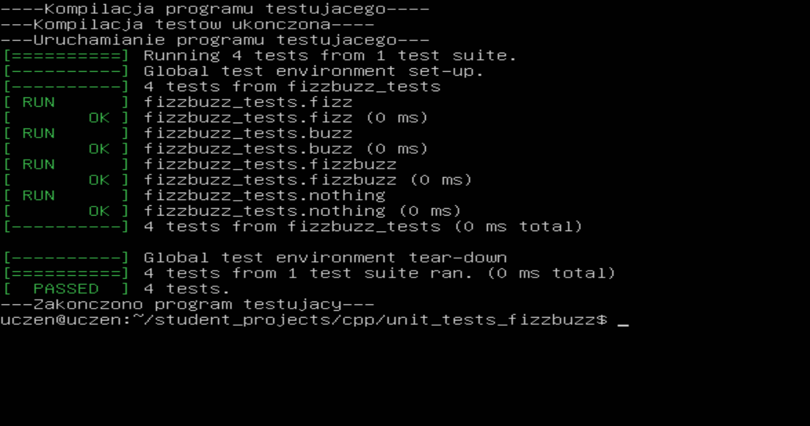

# FizzBuzz

## About

FizzBuzz is very simple exercise of assertion using gtests.

## Code

Firstly, we have a file called 'functions.cpp' where we have one function. It returns 'Fizz' when given number is divided by 3, 'Buzz' when divided by 5, and 'FizzBuzz' when divided by both.

```cpp
string fizzbuzz(int number) {

    string result = "";

    if(number % 3 == 0) {
	result += "Fizz";
    }

    if(number % 5 == 0) {
	result += "Buzz";
    }

    return result;
}
```

We want to use this function in our 'main.cpp' file with random numbers (I know it's silly but hey it's only a school exercise).

```cpp
int main() {

    srand(time(0));
    int i = (rand() % 1000) + 1;

    string fb = fizzbuzz(i);

    cout << endl << i << " goes " << (fb != "" ? fb : "nothing") << endl << endl;

    return 0;
}
```

But first we want to make sure the 'fizzbuzz' function is working properly. That's why we have 'main_test.cpp' file, where we test it using gtests, for different numbers.

```cpp
TEST(fizzbuzz_tests, fizz) {

    EXPECT_EQ(fizzbuzz(6), "Fizz");
}

TEST(fizzbuzz_tests, buzz) {

    EXPECT_EQ(fizzbuzz(10), "Buzz");
}

TEST(fizzbuzz_tests, fizzbuzz) {

    EXPECT_EQ(fizzbuzz(15), "FizzBuzz");
}

TEST(fizzbuzz_tests, nothing) {

    EXPECT_EQ(fizzbuzz(22), "");
}


int main(int argc, char **argv) {
    ::testing::InitGoogleTest(&argc, argv);
    return RUN_ALL_TESTS();
}
```

The rest of files are compilers and things like that.

## Result

After compiling, we can see that the code works perfectly well:
 


Thanks for your time!

## Authors
[Julian9B](https://github.com/Julian9B)
