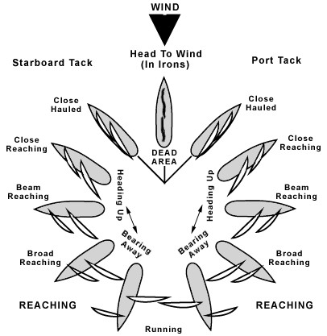
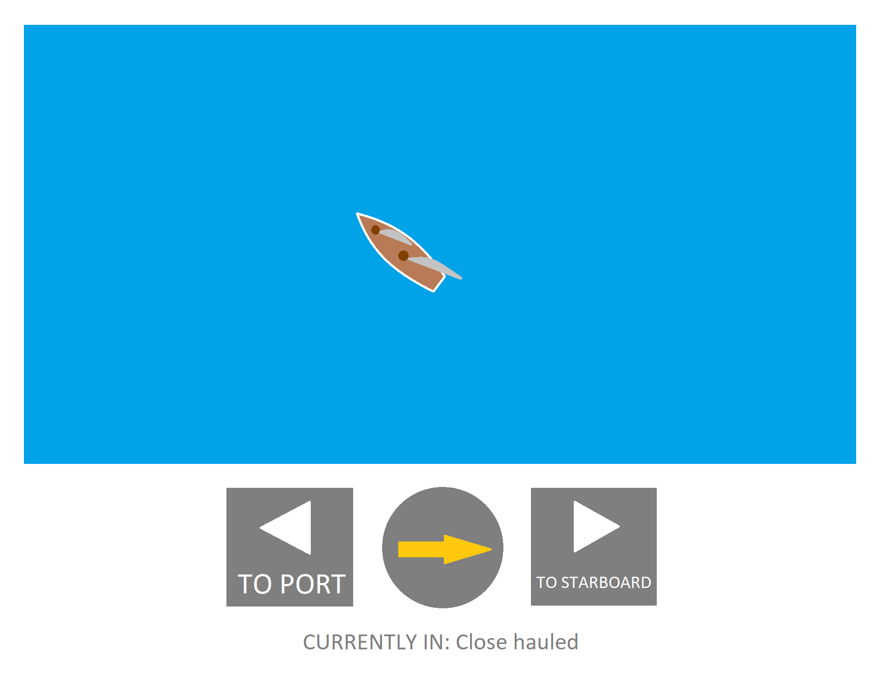

# Sailing simulator

## 1. About

### 1.1 Concept

In this projects our plan is to create a kind of game in .NET MAUI. The main mechanics of the game are randomly generated wind direction, speed of the boat and position of sails related to the heading it's facing.

Img. 1. Different wind directions and position of sails

The player can control the boat by pressing two buttons - turn to port or starboard.

Img. 2. Concept of game's UI

## 2. Code

## 3. Result

## 4. Conclusion

## Authors

[Julian9B](https://github.com/Julian9B)
