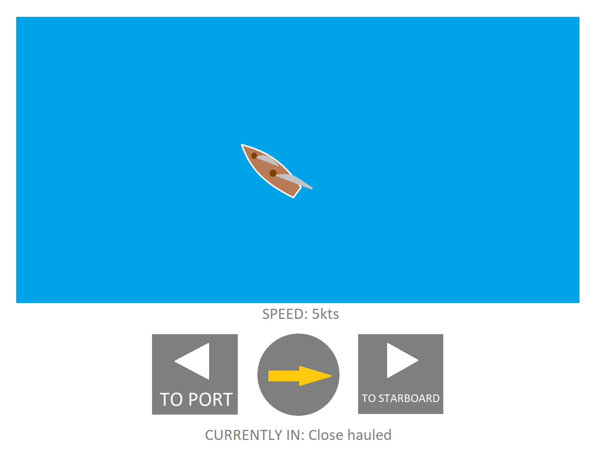

# Sailing simulator

## 1. About

### 1.1. Concept

In this projects our plan is to create a kind of game in .NET MAUI. The main mechanics of the game are randomly generated wind direction, speed of the boat and position of sails related to the heading it's facing.

Img. 1. Different wind directions and position of sails

The player can control the boat by pressing two buttons - turn to port or starboard.

Img. 2. Concept of game's UI

### 1.2. Plan

1. The app displays 'Start' button.
2. When users hits it, the app draws a random angle of rotation, representing wind's direction.
3. The app displays UI, with buttons, boat and the arrow (rotation based on random direction) in center.
4. When user moves the boat (view.TranslateTo function), the app calculates the difference between boat's rotation and wind's direction and adjusts boat's speed.
5. App changes position of sails, according to boat's positoin relative to wind's direction.

## 2. Code

## 3. Result

## 4. Conclusion

## Authors

[Julian9B](https://github.com/Julian9B)
